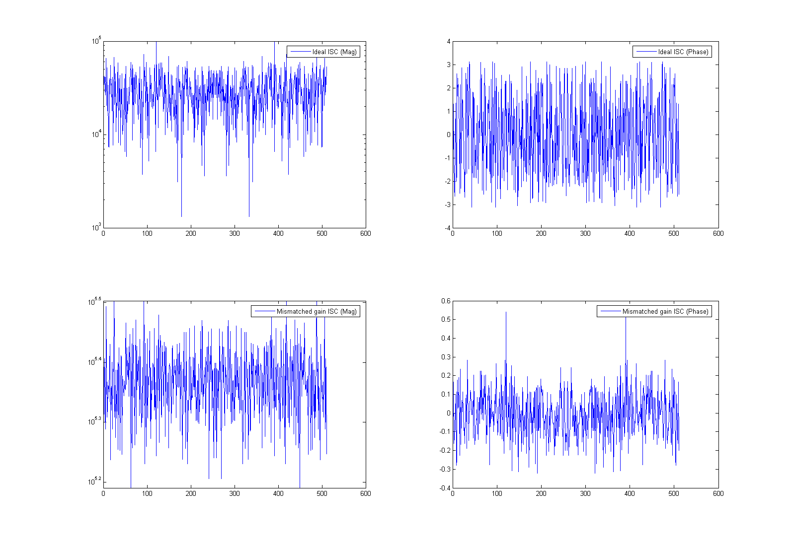

Effects of Mismatches Between Interleaved Analog-to-Digital Converters
======================================================================

D. H. E. MacMahon
-----------------

### June 19, 2006

Introduction
------------

High speed analog to digital converters often achieve maximum sampling
rates by interleaving slower ADCs. While this allows for very high
effective sample rates, it also provides opportunities for the
introduction of less desirable features into the system if the
interleaved ADCs are not ideally matched in terms of amplitude response,
frequency response, DC bias, etc. Through analysis and simulation, this
memo explores the effects introduced by two types of potential
mismatches in a dual interleaved ADC configuration: amplitude response
and DC bias.

Amplitude Response Mismatch
---------------------------

An amplitude response mismatch between the ADCs can be thought of as
multiplying the ideal sample stream by two interleaved impulse trains:
one with unity gain, the other with non-unity gain. These interleaved
impulse trains are equivalent to a sinusoidal waveform at the Nyquist
frequency (i.e. half the sampling frequency) with a DC offset.
Multiplying the ideal sample stream by this Nyquist frequency "carrier"
tone introduces a frequency-reversed image of the input signal into the
spectrum.

The magnitude of the image depends on the degree of gain mismatch. In
the case of every other sample being zero (e.g. if one of the
interleaved ADCs is "dead"), the magnitude of the image will be the same
as the magnitude of the desired signal. The image cannot be detected by
looking at an integrated power spectrum of noise that is band limited
with a center frequency at half the Nyquist frequency because in that
case the image, although reversed in frequency, exactly overlays the
actual spectrum. The effect can be seen with a pure tone (not at half
Nyquist) or band limited noise that is not centered at half the Nyquist
frequency.

DC Bias Mismatch
----------------

A DC bias mismatch between the ADCs can be thought of as adding an
impulse train at the Nyquist frequency to the ideal sample stream. This
has the effect of introducing a small overall DC bias to the input
signal as well as a small sinusoidal component at the Nyquist frequency.
This pollutes a quite limited part of the band (only two frequencies)
and is therefore a much less nefarious problem than the mismatched
amplitude response.

Simulation
----------

The above conclusions have been simulated using Octave -- an open
source, largely Matlab-compatible mathematics program. The simulation
script (shown in Appendix A below) performs these steps:

1.  Generates 1024\*1024 (i.e. 2\^20) input signal of normally
    distributed random numbers.
2.  Generates a 50% to 75% bandpass digital filter and creates a band
    limited version of the input signal.
3.  Simulates both a 20 % ADC amplitude response mismatch by copying the
    broadband and band limited signals and then multiplying every other
    sample by 1.2.
4.  Simulates a 1% of dynamic range DC offset by adding 0.05 of the RMS
    value to every other sample of copies of the two inputs. This
    presumes that the level of the input signals is 20% of the overall
    dynamic range.
5.  Simulates both effects simultaneously by doing steps 3 and 4 to
    additional copies of the input signals.
6.  Plots the integrated power spectrum (1024 points per spectrum) of
    all the various signals. These plots are shown in Figure 1 below.
7.  Computes an "intra-spectrum correlation" by multiplying the positive
    frequencies of the spectra by the reversed order positive
    frequencies for both the ideal broadband input and the mismatched
    gain broadband input.
8.  Plots the magnitude and phase of the two intra-spectrum
    correlations. These plots are shown in Figure 2 below.
    The intra-spectrum correlation of the ideal input shows no
    coherence, while that of the mismatched gain signal does show
    coherence (as well as a larger magnitude relative to the ideal
    input's intra-spectrum correlation). This demonstrates that there is
    an image in the mismatched gain broadband input even though the
    integrated power spectrum showed no obvious image.

**Figure 1**


**Figure 2**


Recommendations
---------------

When testing systems that include interleaved ADCs, a measure of the
amplitude response mismatch between the ADCs should be performed.
Various means of making this measurement can be contrived, but capturing
raw ADC samples and analyzing them offline is perhaps the most
versatile.

If the interleaved ADCs provide a means of controlling the relative
amplitude response (i.e. gain) of the ADCs, then creation of an on-line
calibration feedback loop is possible. In this scheme, samples of a
known input are captured, image detection (e.g. via the intra-spectrum
correlation) is performed, and gain compensation is calculated/adjusted
until the image is minimized (e.g. coherence in the intra-spectrum
correlation is minimized).

Frequency response mismatch, not discussed in this memo, is essentially
a frequency dependent amplitude response mismatch, so the potential
exists for multiple images depending on the the frequency response
mismatch and the frequency content of the input.


Appendix A
----------
adcmismatch.m
```matlab
% Gaussian noise (1024 vectors with 1024 samples/per vector)
x=randn(1024);

% Order 100 FIR filter (band-pass from 1/2 to 3/4 band)
b=fir1(100,[0.5 0.75]);

% Band limited Gaussian noise
y=filter(b,1,x);

% Simulate 20% gain mismatch between interleaved ADCs
xgain=x;
xgain(1:2:1023,:)=xgain(1:2:1023,:)*1.2;

ygain=y;
ygain(1:2:1023,:)=ygain(1:2:1023,:)*1.2;

% Simulate 1% of dynamic range DC offset between interleaved ADCs
% (Assume RMS of band limited noise is 20% of total dynamic range)
xoff=x;
xoff(1:2:1023,:)=xoff(1:2:1023,:)+0.01*5*std(reshape(x,1,2^20),1);

yoff=y;
yoff(1:2:1023,:)=yoff(1:2:1023,:)+0.01*5*std(reshape(y,1,2^20),1);

% Simulate both effects
xboth=x;
xboth(1:2:1023,:)=xboth(1:2:1023,:)*1.2+0.01*5*std(reshape(x,1,2^20),1);

yboth=y;
yboth(1:2:1023,:)=yboth(1:2:1023,:)*1.2+0.01*5*std(reshape(y,1,2^20),1);

% Plot integrated spectra of all signals
subplot(4,2,1);
semilogy(sum(abs(fft(x)),2));
legend('Ideal (broadband)');

subplot(4,2,2);
semilogy(sum(abs(fft(y)),2));
legend('Ideal (band limited)');

subplot(4,2,3);
semilogy(sum(abs(fft(xgain)),2));
legend('Gain Mismatch (broadband)');

subplot(4,2,4);
semilogy(sum(abs(fft(ygain)),2));
legend('Gain Mismatch (band limited)');

subplot(4,2,5);
semilogy(sum(abs(fft(xoff)),2));
legend('DC Offset Mismatch (broadband)');

subplot(4,2,6);
semilogy(sum(abs(fft(yoff)),2));
legend('DC Offset Mismatch (band limited)');

subplot(4,2,7);
semilogy(sum(abs(fft(xboth)),2));
legend('Gain and DC Offset Mismatch (broadband)');

subplot(4,2,8);
semilogy(sum(abs(fft(yboth)),2));
legend('Gain and DC Offset Mismatch (band limited)');

% Compute and plot intra-spectrum correlations
figure(2);
fx=fft(x);
fxg=fft(xgain);
fxxf=fx(2:512,:).*fx(512:-1:2,:);
fxggxf=fxg(2:512,:).*fxg(512:-1:2,:);

subplot(2,2,1);
semilogy(abs(sum(fxxf,2)));
legend('Ideal ISC (Mag)');

subplot(2,2,2);
plot(angle(sum(fxxf,2)));
legend('Ideal ISC (Phase)');

subplot(2,2,3);
semilogy(abs(sum(fxggxf,2)));
legend('Mismatched gain ISC (Mag)');

subplot(2,2,4);
plot(angle(sum(fxggxf,2)));
legend('Mismatched gain ISC (Phase)');atlab

```