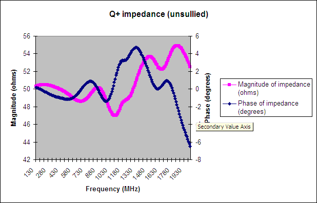
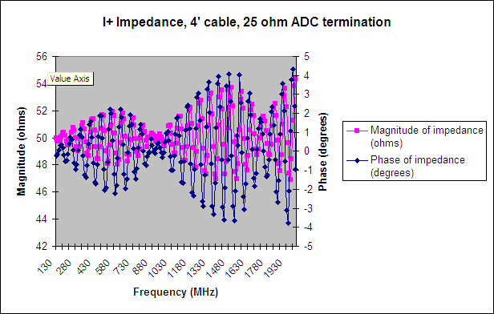
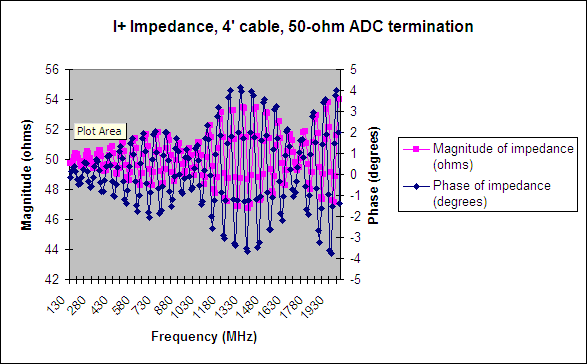
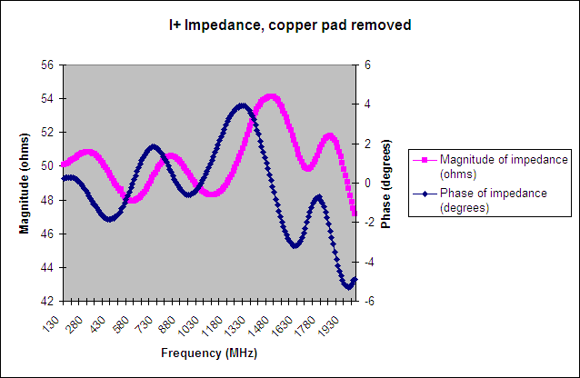
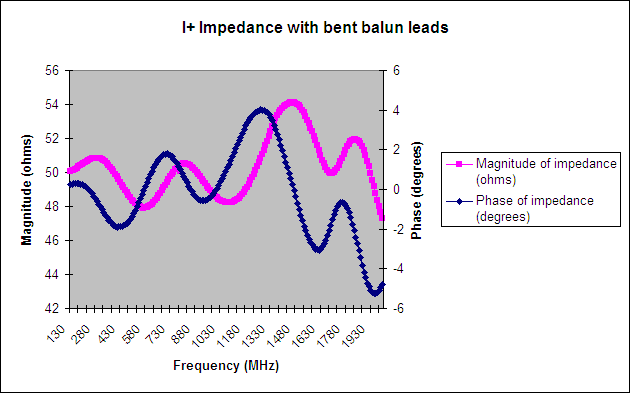

ADC impedance response characteristics
======================================

Christina de Jesus
------------------

### July 2006

Introduction
------------

The iADC, which can digitize either two streams of data at 1 Gsps or one
stream of data at 2 Gsps, was designed to be the IBOB's input data
source. It has seven SMA input ports: I+, I-, clk\_i, sync, Q+, Q-, and
clk\_q. Each of these input ports was designed for 50-ohm termination.
I- and Q- traces have been cut in all 0.2.x ADCs, and likely will be in
future runs.

The ADC input circuit can be divided into three sections: SMA connector
to the balun input; balun; balun output to ADC input. Each of these
sections was isolated in the measurements below. Each ADC input is
terminated by two 50-ohm resistors to ground; these termination
resistors were changed to 25 ohms as noted below.

Motivation
----------

Strange behavior (e.g. spikes, dips) in output data was noticed during
tests of various designs, including the pocket spectrometer and
eight-station correlator. The following measurements of the ADC's input
impedance were undertaken to determine if imperfect input impedance
matching was a cause of such behavior.

Consulted for advice because of his RF experience, Doug Thornton at
Campbell Hall offered several suggestions for implementation in the next
revision of the ADC board:
1. Use sidelaunch SMA connectors instead of right-angle connectors.
2. Reduce the length of balun leads as much as possible (reduces
inductance); use Mini-Circuits TC1-1-13M instead of current Macom
TP-101.
3. Move balun pads as close to balun as possible. 4. Minimize copper pad
ring around SMA input pin (reduces capacitance).
5. Terminate ADC input with 25-ohm resistors instead of 50-ohm resistors
(to terminate balun properly).
Other possible improvements include enlisting an RF expert to redesign
the board and using a fab that specializes in RF applications, and using
a different ADC chip that digitizes a wider bandwidth.

Data and conclusions
--------------------

Data were taken at the BWRC with ADC 0.2.13 using their HP 8719C Network
Analyzer. The instrument was set to measure s-parameter 11 (forward
reflection) with a test port power of -10 dBm. The test signal was swept
from 130MHz to 2GHz, and data points were taken in 10MHz increments.

Overall, the input impedance varies +/- 4 ohms from 50 ohms at -10dBm,
even when attached to a 4' cable. Measurements of other test port power
levels (-30dBm to 0dBm) will be added to this memo at a later date.
**Any input signal power to the ADC must be no greater than -10dBm
(though the input clock may be 0dBm without issue).** Input signal
powers greater than -10dBm experience severe degradation at the input
due to imperfect termination.

All of the following plots and data may be found in the Excel
spreadsheet located at
[adcimpedance.xls](ADC_impedance_response_characteristics_files/adcimpedance.xls).

First, the input impedance of ADC 0.2.13's I+ input was measured. (ADC
0.2.12's measurement is used here because the network analyzer used for
0.2.13 was faulty, and subsequent modifications to 0.2.13 made this
measurement impossible. It is assumed that all boards have similar
characteristics, as they were manufactured simultaneously by the same
company.) The I+ input was connected to the network analyzer via a SMA
coupler.

\
Figure 1. I+ Impedance of ADC 0.2.12.

For comparison with the above, measurements of the Q+ input and an old
ADC without cut traces are provided. Both inputs were connected to the
network analyzer via a SMA coupler.

\
Figure 2. Q+ Impedance of ADC 0.2.13.

.PNG)\
Figure 3. I+ Impedance of ADC 0.1.3.

Upon Doug Thornton's suggestion, the 50-ohm ADC input termination
resistors were switched to 25-ohms. In the first plot, the ADC was
connected to the network analyzer via a SMA coupler; in the second, the
ADC was connected via a four-foot SMA cable. The third plot shows the
original 50-ohm termination with the ADC connected via a four-foot
cable.

\
Figure 4. I+ Impedance of ADC 0.2.13, 25-ohm ADC termination resistors
replacing original 50-ohm resistors.

\
Figure 5. I+ Impedance of ADC 0.2.13, 25-ohm ADC termination resistors
through 4' cable.

\
Figure 6. I+ Impedance of ADC 0.2.13, original 50-ohm ADC termination
resistors through 4' cable.

Scraping off copper pad around the SMA input pin did little to improve
the impedance. The ADC was connected to the network analyzer via a SMA
coupler.

\
Figure 7. I+ Impedance of ADC 0.2.13, copper pad around SMA input pin
removed.

Bending down the long balun leads (moving them closer to the ground
plane) also did little to improve the impedance. The ADC was connected
to the network analyzer via a SMA coupler.

\
Figure 8. I+ Impedance of ADC 0.2.13, balun leads bent flush with ground
plane.

The following two plots show the effects of parts of the input circuit
on the impedance. These measurements were taken after the copper pad was
cut away and the balun leads bent. The ADC was connected to the network
analyzer via a SMA coupler.

For this measurement, the balun was disconnected from the SMA connector
and replaced with a 50 ohm resistor to ground, isolating the connector
from the rest of the circuit.

\
Figure 9. I+ Impedance of ADC 0.2.13, SMA connector only.

After restoring the connection between the SMA connector and balun, the
balun-ADC traces were cut at the balun pads and replaced with two 25-ohm
resistors to ground, isolating the balun from the ADC.

\
Figure 10. I+ Impedance of ADC 0.2.13, SMA connector to output of balun
only (ADC isolated from rest of circuit).

It is apparent that with signal levels at -10dBm, the input impedance of
the ADC is within 10% of 50 ohms for most of the input range. The effect
of this variation may not be sufficient to explain the strange behavior
observed during testing of various designs.
