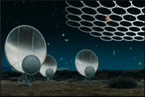
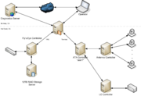
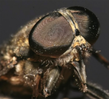

# ATA "Fly's Eye" Pulse Finder

## People
- Griffin Foster
- Peter McMahon
- Andrew Siemion
- Joeri van Leeuwen
- Geoff Bower
- Dan Werthimer

## Experiment and Instrumentation

The ATA Fly's Eye experiment, aka FindPulse, uses the 42
currently-installed dishes at ATA to search for radio transients. The
experiment began December 20, 2007. In the nominal configuration, the
experiment points each of the 42 dishes in different directions to cover
a total of 150 square degrees on the sky (at L-band).

The instrumentation consists of 11 IBOBs, which each behave as 4
independent spectrometers, each of which individually processes a 209.5
MHz band over 128 spectral channels with a 0.6 ms integration time. The
experiment is currently operating in L-band, although this may change
via the ATA tunable IF. The design is similar to the [Pocket
Correlator](Pocket_Correlator "wikilink"); the most important difference
is that the calculation of cross-terms between the 4 inputs has been
removed.

Readout is done via the 100MbE port on each IBOB. The CAT cables are
connected to a 1GbE switch, which is connected to a data storage server.
Data is sent using UDP at a rate of approximately 7Mbit/sec per IBOB,
yielding an aggregate data rate of \~77Mbit/sec.

Data are then dedispersed and searched for pulses on a compute node.

## Deployment

The Fly's Eye hardware was deployed at Hat Creek/ATA over 19 and 20
December 2007. Basic data recording and control facilities are in place,
and the system has passed several sanity checks including detection of a
transmitted chirp pulse. [list of antenna-to-IBOB
connections](ATA_antenna_connections "wikilink") and [notes
on the computer installs](FlyEye_Node "wikilink").

## Results

### [Internal Fly's Eye Results Page](https://casper.ssl.berkeley.edu/wiki/Internal_Fly%27s_Eye_Results_Page)

### [FE Satellite Detection](https://casper.ssl.berkeley.edu/wiki/FE_Satellite_Detection)

## Operation Instructions

A set of
[instructions](ATA_operation_instructions "wikilink") for
operating the Fly's Eye experiment at ATA has been compiled.

## People

Fly's Eye Team:

Geoff Bower (UCB Astronomy), Griffin Foster (CASPER), Peter McMahon (CASPER, KAT), Andrew Siemion
(CASPER), Joeri van Leeuwen (UCB Astronomy, CASPER), Mark Wagner, Dan Werthimer (UCB SSL, CASPER)

With Advice and Assistance From:

Don Backer (UCB Astronomy, RAL, CASPER), Colby Craybill (RAL), Matt
Dexter (RAL, CASPER), David McMahon (RAL, CASPER), Mel Wright (UCB
Astronomy, RAL, CASPER)

The idea for this experiment was suggested by Jim Cordes (Cornell)

## Documentation

Andrew Siemion. ["The Fly's Eye: Instrumentation for Detection of Radio
Ephemeron"](https://www.researchgate.net/publication/266473154_The_Fly's_Eye_Instrumentation_for_Detection_of_Radio_Ephemeron_The_Fly's_Eye_Team) AB
Undergraduate Honors Thesis, Department of Astronomy, University of
California, Berkeley. Jan 2008.

Peter McMahon. ["Adventures in Radio Astronomy Instrumentation and
Signal
Processing"](https://arxiv.org/abs/1109.0416) M.Sc.
Thesis, Department of Electrical Engineering, University of Cape Town.
July 2008. *Chapter 3 -- The Fly's Eye: Instrumentation for the
Detection of Millisecond Radio Pulses*

The Fly's Eye and SETI Teams. ["New SETI Sky Surveys for Radio
Pulses"](http://arxiv.org/abs/0811.3046) arXiv preprint. November 2008.

## Data

Some of the [Fly's Eye Data](FE_Data "wikilink") can be downloaded
[here](FE_Data "wikilink").

## Images

     

